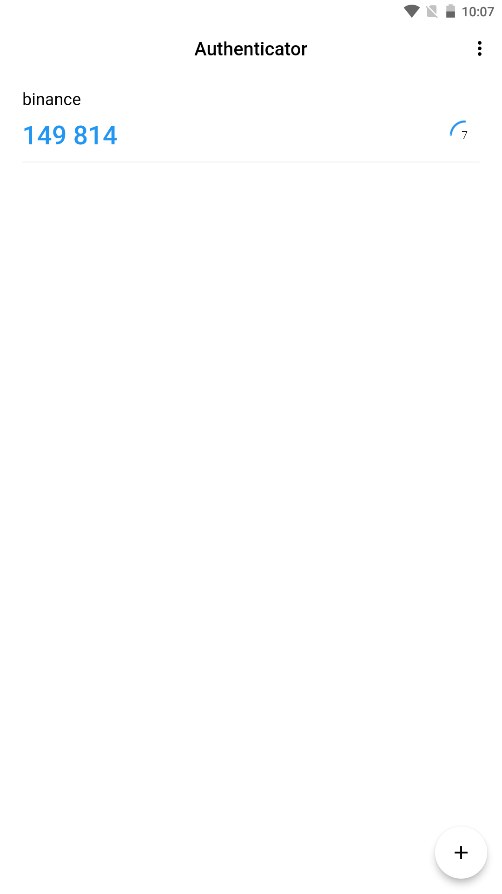

Authenticator generates 2-Step Verification codes on your phone like Google Authenticator.

2-Step Verification provides stronger security for your Account by requiring a second step of verification when you sign in. In addition to your password, you’ll also need a code generated by the Authenticator app on your phone.This app generates one-time tokens on your device which are used in combination with your password. This helps to protect your accounts from hackers, making your security bulletproof. Just enable the two-factor authentication in your account settings for your provider.

Features:
* Generate verification codes without a data connection
* Authenticator works with many providers & accounts
* Dark theme available
## authenticator

Technologies

Technologies that are used in this projects are:

    Flutter
    MVVM Architecture
    Dio
    Hive
    Get Storage
    Flutter secure storage
    Otp

## Screenshot

<table border>
    <tr>
        <th style="text-align:center">Empty Screen | Light</th>
        <th style="text-align:center">Home Screen | Light</th>
        <th style="text-align:center">Form Screen | Light</th>
    </tr>
    <tr>
        <td></td>
        <td></td>
        <td></td>
    <tr>
</table>

<table border>
    <tr>
        <th style="text-align:center">Empty Screen | Dark</th>
        <th style="text-align:center">Home Screen | Dark</th>
        <th style="text-align:center">Form Screen | Dark</th>
    </tr>
    <tr>
        <td></td>
        <td></td>
        <td></td>
    <tr>
</table>
